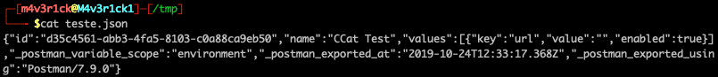
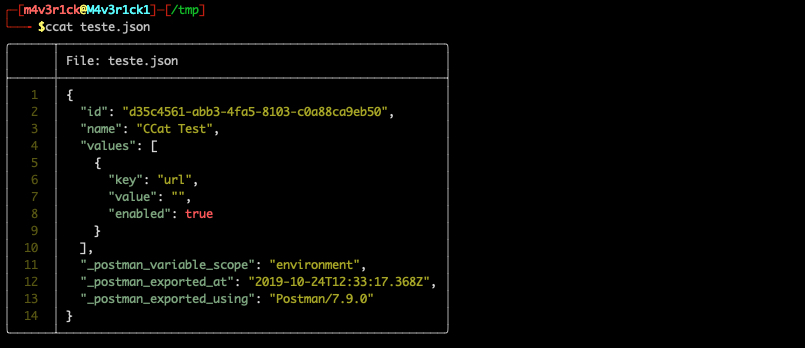
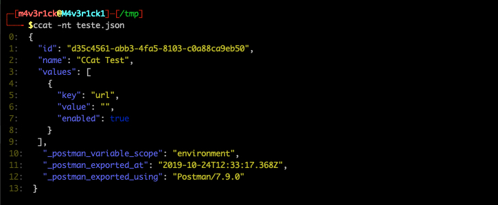
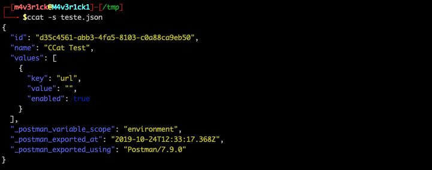
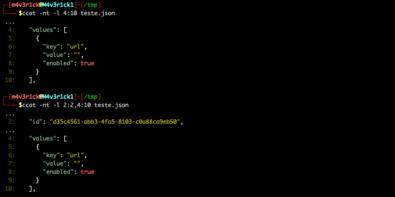

# Colored Cat

[](https://github.com/helviojunior/pyccat/actions/workflows/build_and_publish.yml)
[](https://github.com/helviojunior/pyccat/actions/workflows/build_and_test.yml)
[](https://pepy.tech/project/pyccat)
[](https://pypi.org/project/pyccat)
[](https://github.com/helviojunior/pyccat/graphs/contributors)
[](https://pypi.org/project/pyccat/)
[](https://github.com/helviojunior/pyccat/blob/main/LICENSE)

CCat officially supports Python 3.8+.

## Main features

* [x] Read and highlight text and code files
* [x] Filter to display only selected lines
* [x] Multiple highlight styles

## Installation

```bash
pip3 install --upgrade pyccat
```

## Executing

**Regular linux cat**


**Read a file**
```bash
ccat /tmp/teste.json
```



**Read a file without table**
```bash
ccat -nt /tmp/teste.json
```



**Just highlight the file**
```bash
ccat -s /tmp/teste.json
```



**Display only some lines**
```bash
ccat -nt -l 4:10 teste.json
ccat -nt -l 2:2,4:10 teste.json
```


