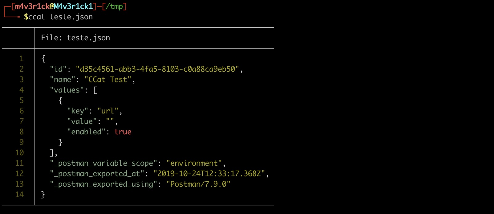
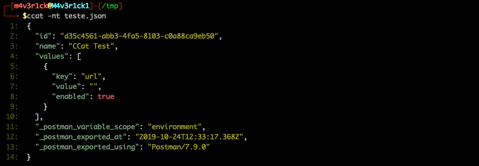
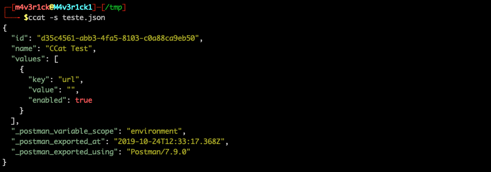
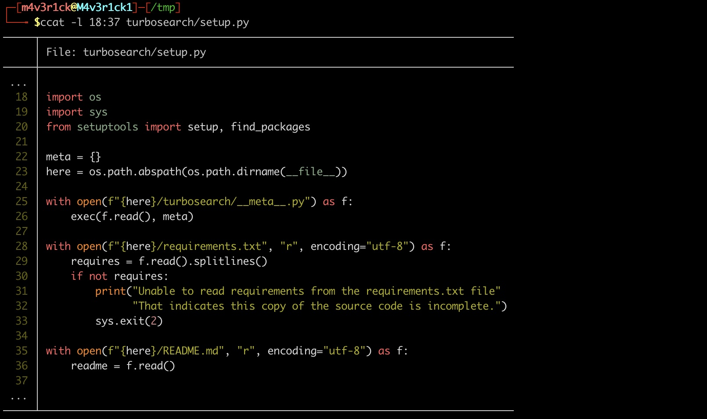
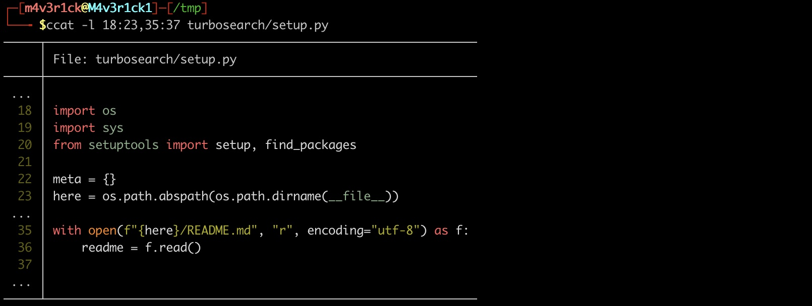
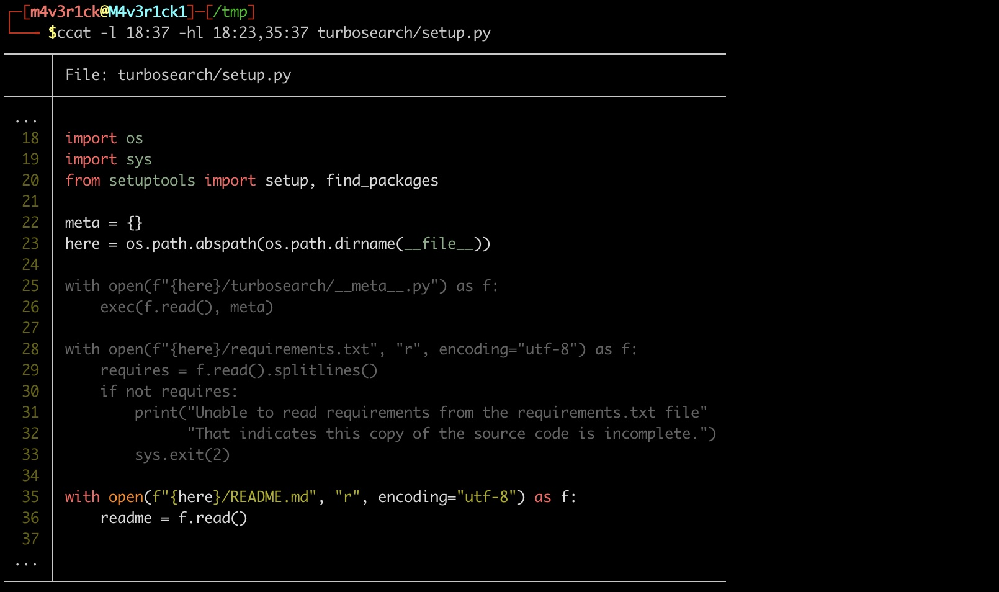

# Colored Cat

[](https://github.com/helviojunior/pyccat/actions/workflows/build_and_publish.yml)
[](https://github.com/helviojunior/pyccat/actions/workflows/build_and_test.yml)
[](https://pepy.tech/project/pyccat)
[](https://pypi.org/project/pyccat)
[](https://github.com/helviojunior/pyccat/graphs/contributors)
[](https://pypi.org/project/pyccat/)
[](https://github.com/helviojunior/pyccat/blob/main/LICENSE)

CCat officially supports Python 3.8+.

## Main features

* [x] Read and highlight text and code files
* [x] Filter to display only selected lines
* [x] Multiple highlight styles
* [x] Save output at image (png/jpg) file using ansi2image lib.

## Installation

```bash
pip3 install --upgrade pyccat
```

## Help

```bash
ccat -h

positional arguments:
  [filename]                                Filename

Options:
  -s, --simple                              just colorize the file content
  -nt, --no-tabulated                       do not show tab
  --style [style name]                      pygments lib style name. (default: gruvbox-dark). See more at: https://pygments.org/styles/
  -l [filter], --lines [filter]             return only selected lines (ex1: 5:13 or ex2: 50: or ex3: :100)
  -hl [filter], --highlight-lines [filter]  highlight only selected lines (ex1: 5:13 or ex2: 50: or ex3: :100)
  --output-img [filename]                   image output file.
  -h, --help                                show help message and exit
  -v                                        Specify verbosity level (default: 0). Example: -v, -vv, -vvv
  --version                                 show current version
```

## Executing

**Regular linux cat**


**Read a file**
```bash
ccat /tmp/teste.json
```



**Read a file without table**
```bash
ccat -nt /tmp/teste.json
```



**Just highlight the file**
```bash
ccat -s /tmp/teste.json
```



**Display only some lines**
```bash
ccat -l 18:37 teste.json
```



```bash
ccat -l 18:23,35:37 teste.json
```




**Display only some lines and highlight specific lines**
```bash
ccat -l 18:37 -hl 18:23,35:37 teste.json
```


